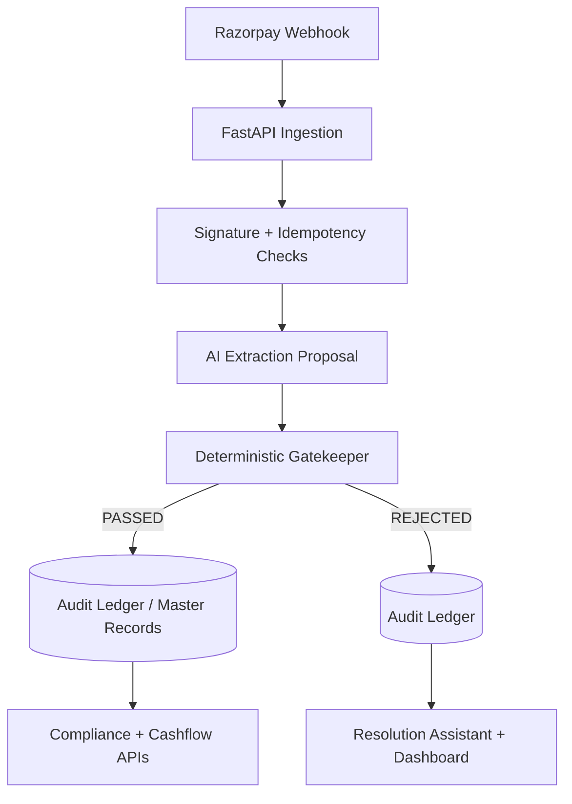

# AI Finance Controller

AI Finance Controller is a production-oriented reconciliation service for Razorpay settlement webhooks.
It combines AI-based data extraction with deterministic validation so settlement decisions remain auditable and safe for finance operations.

## Why this project exists

Payment descriptions are often unstructured, but reconciliation needs exact arithmetic and traceable controls.
This project focuses on:

- extracting invoice references from noisy settlement descriptions,
- validating fee and amount logic with strict deterministic checks,
- blocking risky or inconsistent settlements,
- logging complete audit trails for finance and compliance teams.

## Core capabilities

- **Secure webhook ingestion** with HMAC signature verification (`X-Razorpay-Signature`)
- **Rate-limited API** for basic abuse protection
- **Idempotent processing** with Redis-backed duplicate protection
- **Asynchronous workflow** that returns `200 OK` quickly and processes in background
- **Deterministic rules engine** to prevent math hallucinations from affecting outcomes
- **Audit ledger** in SQLite for accepted, rejected, and error records
- **Compliance endpoints** for proof-of-business and risk scoring
- **Cashflow transit tracking** for T+N visibility
- **Resolution assistant APIs** for customer-facing remediation actions

## Architecture overview



## Tech stack

- **Backend:** Python, FastAPI, AsyncIO
- **AI Layer:** Gemini via `instructor` + schema-constrained proposals
- **Data Layer:** SQLite, Redis
- **Dashboard & Analysis:** Streamlit, Pandas
- **DevOps:** Docker, Docker Compose, GitHub Actions

## Repository map

- `/main.py` — FastAPI app, webhook ingestion, and API endpoints
- `/gatekeeper.py` — deterministic reconciliation rules
- `/ai_service.py` — AI extraction and fallback logic
- `/audit_ledger.py` — audit persistence and query helpers
- `/transit_tracker.py` — cashflow transit tracking
- `/compliance_shield.py` — compliance reporting and risk scoring
- `/resolution_assistant.py` — remediation playbooks and customer messaging
- `/eval_ui.py` — Streamlit evaluation and operations dashboard

## Quick start

### 1) Configure environment

```bash
cp .env.example .env
```

Set values in `.env`:

```bash
GEMINI_API_KEY=your_api_key
RAZORPAY_WEBHOOK_SECRET=your_webhook_secret
REDIS_URL=redis://localhost:6379
```

### 2) Run with Docker (recommended)

```bash
docker-compose up --build
```

Services:

- API: `http://localhost:8000`
- Dashboard: `http://localhost:8501`
- Redis: `localhost:6379`

### 3) Run locally

Install dependencies:

```bash
pip install -r requirements.txt
```

Start Redis (example):

```bash
docker run --rm -p 6379:6379 redis:alpine
```

Run API:

```bash
python main.py
```

Run dashboard in a second terminal:

```bash
python -m streamlit run eval_ui.py
```

## API surface

### Core

- `POST /webhook/razorpay`
- `GET /metrics`

### Compliance

- `POST /compliance/proof-of-business`
- `GET /compliance/risk-score`

### Cashflow

- `GET /cashflow/snapshot`
- `GET /cashflow/transit-items`

### Resolution assistant

- `GET /resolution/{failure_type}`
- `POST /api/resolutions/{settlement_id}/request-payment-link`
- `POST /api/resolutions/{settlement_id}/reopen-invoice`
- `POST /api/resolutions/{settlement_id}/acknowledge`

## Testing

Run the same primary test suite used in CI:

```bash
pytest test_eval.py -v
```

Additional focused tests are available in:

- `test_gatekeeper.py`
- `test_compliance.py`
- `test_transit.py`
- `test_resolution.py`
- `test_live_webhook.py`

## License

This project is licensed under the MIT License. See `LICENSE` for details.
